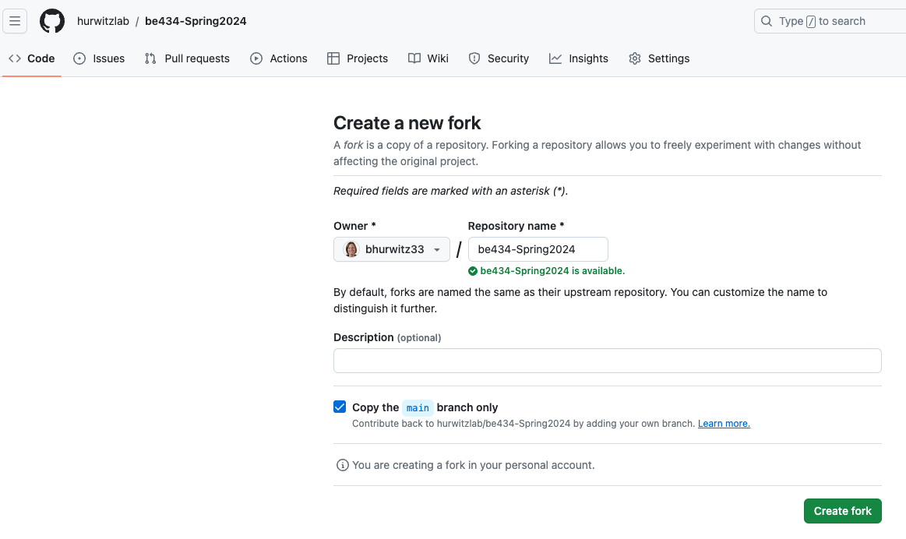

# Task 2: Getting started with Github

All of the homework assignments for this class will be submitted using GitHub, a freely available code repository. GitHub allows programmers to share and collaboratively write code together. It also allows users to track changes they make in their code and revert back to older versions if needed. As part of this class you will share your code with me (your instructor Bonnie Hurwitz) so that I can grade your assignments. If you get stuck you can also "push" your code to Github and I can point out errors or mistakes for you to fix.

Also, all of the course materials are available to you in a GitHub repository. Below, you will learn how to make a copy of this repository and use it for writing code and turning in homework assignments.

## Creating a GitHub account

First, you will need to create a GitHub account and copy the course repository into your own account.
This will allow you to have your own copy of the assignments, a place to write programs, and a repository in Github that you can submit your assignments to.  

Create your free [GitHub](http://github.com) account 

* Go to [GitHub](http://github.com)
* Create a (free) user account

## Copy the course repository to your own GitHub account

Go to the [course repository](https://github.com/hurwitzlab/be434-Spring2024) and click the "Fork" button to make a copy of the code into your own Github account.

* Go to [the course repo](https://github.com/hurwitzlab/be434-Spring2024)
* Click the "Fork" button (upper-right)
* Indicate that you will use it for personal reasons




This will create a new repository in YOUR Github account. 

## Share your "copy" of the course repository with the instructor

All your assignments will be pushed to GitHub where I will pull the code to my machine for checking and grading. Add my GitHub username "bhurwitz33" as a Collaborator on your repo so that I can push and pull code, and then email me your GitHub username and the URL for your repo (bhurwitz@arizona.edu). At the end of the semester, you will have a public repository of code to show proficiency in Python coding and testing. 

* Go to the "Settings" for your repository called "be434-Spring2024"
* Choose "Manage Access" from the left panel
* Click the green "Invite a collaborator" button
* Add "bhurwitz33" and send


## "clone" your course repository onto the UA campus HPC

We are going to use the campus high-performance compute (HPC) cluster as a place to store a copy of your code. This way, you won't need to install Python, or any of the Python modules we will use for this class on your own computer. This also helps us use a consistent coding environment through a package manager called conda. This will all make much more sense later! For now, let's get started by "cloning" or copying your "be434-Spring2024" Guthub repository onto the HPC.

You should have all received an invitation to the campus HPC from me, as your sponsor. If you haven't, please email me right away so I can add you (bhurwitz@arizona.edu).

### Logging into the HPC.

First, you will need to login to the HPC using the [ondemand web portal](https://ood.hpc.arizona.edu/pun/sys/dashboard). From the HPC ondemand portal navigate to Clusters -> Shell from the top menu. You will be directed to the Bastion host, where you will get to choose which cluster you would like to login to. We will be using ocelote, our training cluster. To access ocelote and clone your repository to the HPC, copy and paste the commands below into the shell prompt. Be sure to change YOUR_GITHUB_ID with the user id you selected for Github.  

```
ocelote
git clone https://github.com/YOUR_GITHUB_ID/be434-Spring2024.git
cd be434-Spring2024
```

I might update my copy of the class Githib repository over the course of the semester, after you have made your copy. To get any updates from my repository, you will need to add my repositry as an "upstream" source. You can do this with the following commands:

```
git remote add upstream https://github.com/hurwitzlab/be434-Spring2024.git
git pull upstream main
```

## Making changes and "pushing" them to your Github repository.

As you complete assignments over the course of the semester, you will "push" you code to your repository, where I can grade it. Let's test this out. This will be a graded assignment to show that you have been able to complete the setup. Using the same Shell prompt in the section above ("Logging into the HPC"), run the following commands:

```
cd
cd be434-Spring2024
echo "Testing 1,2,3" > assignments/00_getting_started/test.txt
git add assignments/00_getting_started/test.txt
git commit -m "checking commit for test"
git push
```

Did that work? If not, email me with any errors so we can get you on track.


## Authors

Bonnie Hurwitz <bhurwitz@arizona.edu> and Ken Youens-Clark <kyclark@gmail.com>