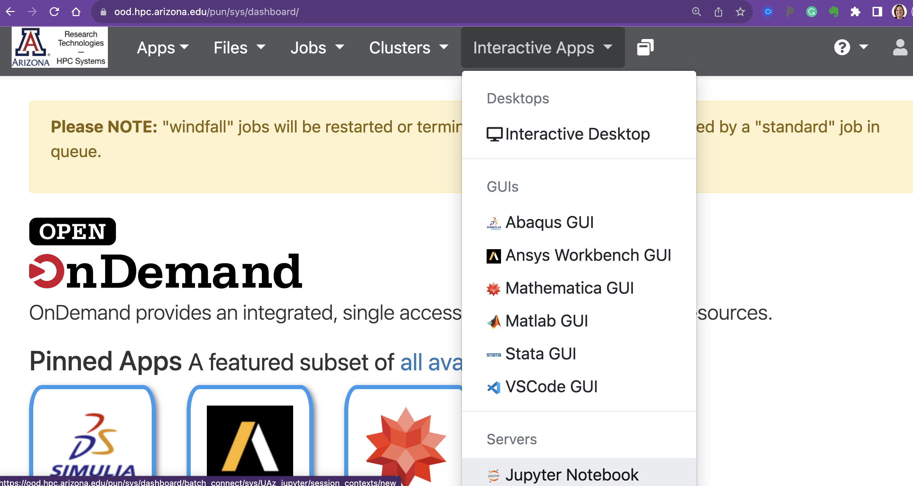

# Getting started on the HPC

## What is the HPC?

HPC is an acronym for "high-performance computing," and it generally means using a cluster of computers. Students have access to several clusters (puma, ocelote, elgato) at the University of Arizona. In our case, we are going to use ocelote, our training cluster.  

## Steps for HPC access

To get started, please make sure that you have completed these steps:

1. Enroll in Netid+ to access HPC systems. https://webauth.arizona.edu/netid-plus/

2. Create an HPC Account (if you don't already have one). https://account.arizona.edu

3. You should have received an invitation from me to access the HPC and join the bh_class group.

## Logging into the HPC Online Portal and accessing jupyter notebooks at the University of Arizona

1. Go to the HPC web-portal: https://ood.hpc.arizona.edu/pun/sys/dashboard and login with your UA net-id and password. 

2. On the top menu bar select "My Interactive Sessions" and "Jupyter Notebook" from the pull-down list.

3. A settings/launch page will open for you. Select "Ocelote" for the cluster and "bh_class" for the PI group, while keeping all other defaults. Next, select launch to start the Jupyter Notebook. 

The session will then launch and go into queue. It should start within a few minutes, and once it has you can select "run" to start the Jupyter server. All of your homeworks are documented in Jupyter notebooks. So, you will need to look at the instructions for each assignment in the jupyter notebook associated with the assignment.

## Accessing VSCode on the HPC

In addition to using Jupyter, you will be writing our Python code using the VSCode GUI on the HPC. Similar to the steps above, you will need to do the following to access VSCode.

1. Go to the HPC web-portal: https://ood.hpc.arizona.edu/pun/sys/dashboard and login with your UA net-id and password. 

2. On the top menu bar select "My Interactive Sessions" and "VSCode GUI" from the pull-down list.

3. A settings/launch page will open for you. Select "Ocelote" for the cluster and "bh_class" for the PI group, while keeping all other defaults. Next, select launch to start the VSCode session.
